<div align="center">


<h1>Entra ID Conditional Access Toolkit</h1>

<p><strong>The Global Standard for Industrialized Identity Governance and Zero Trust Access Control</strong></p>

[]()
[]()
[]()
[]()

<br/>

> **"Industrializing identity security to enforce Zero Trust boundaries at institutional scale."** 
> Entra ID Conditional Access Toolkit (EI-CAT) is a flagship repository designed to enable global organizations to design, deploy, and govern Microsoft Entra ID access policies through secure guardrails, automated simulation, and multi-tenant reference architectures.

</div>

---

## 🏛️ Executive Summary

**Entra ID Conditional Access Toolkit (EI-CAT)** is a flagship repository designed for CISOs, IAM Leaders, and Identity Architects. As organizations adopt "Identity-as-the-New-Perimeter," the need for a standardized, secure, and audited Conditional Access (CA) framework becomes the critical path for Zero Trust maturity and digital transformation.

This platform provides an industrialized approach to **Identity Governance**, delivering production-ready **Policy Lifecycle Management**, **Risk-Based Access Controls**, **MFA Enforcement Strategies**, and **Device Compliance Integration**. It supports **Microsoft Entra ID** at institutional scale, enabling organizations to transition from "Open Access" to "Industrialized Identity Protection."

---

## 💡 Why Conditional Access Matters

Conditional Access is the "intelligent policy engine" of the modern enterprise:
- **Identity-First Security**: Moving beyond network boundaries to protect users and data wherever they reside.
- **Risk-Based Remediation**: Automatically blocking or challenging high-risk sign-ins based on real-time signals.
- **Verified Compliance**: Ensuring only healthy, managed devices can access sensitive corporate resources.
- **Institutional Guardrails**: Enforcing institutional security baselines across every application and service principal.

---

## 🚀 Business Outcomes

### 🎯 Strategic Identity Impact
- **Reduced Breach Risk**: Eliminating credential-based attacks through mandatory MFA and risk-based blocks.
- **Operational Efficiency**: Centralizing policy management to reduce duplicate effort across complex multi-tenant estates.
- **Accelerated Compliance**: Providing automated evidence for ISO, SOC2, and HIPAA audits through standardized reporting.
- **Improved User Experience**: Using adaptive access to reduce MFA friction for low-risk, compliant users.

---

## 🏗️ Technical Stack

| Layer | Technology | Rationale |
|---|---|---|
| **Policy Engine** | Python, PowerShell, Graph API | High-performance orchestration of institutional CA policies and simulations. |
| **Control Plane** | FastAPI | High-performance API for policy deployment, risk analysis, and identity health. |
| **Frontend** | React 18, Vite | Premium portal for executive dashboards, policy center, and identity scorecards. |
| **Automation** | Microsoft Graph SDK | Deep native integration with the Entra ID ecosystem for policy-as-code delivery. |
| **Database** | PostgreSQL | Centralized repository for policy inventory, risk telemetry, and compliance evidence. |
| **Observability** | Prometheus / Grafana | Real-time monitoring of policy drift, MFA coverage, and identity risk spikes. |

---

## 📐 Architecture Storytelling: 85+ Diagrams

### 1. Executive High-Level Architecture
The holistic vision of the enterprise identity security journey.

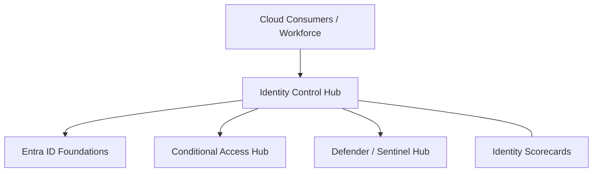

### 2. Detailed Toolkit Topology
The internal service boundaries and management layers of the industrialized toolkit.

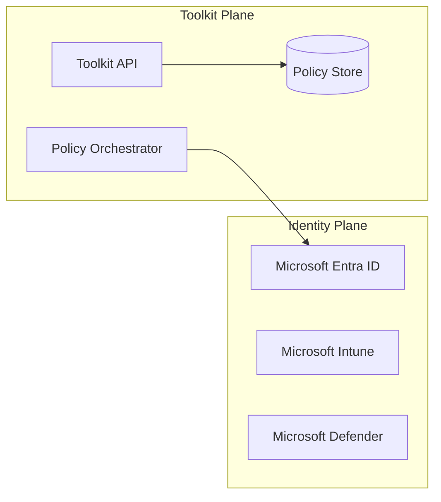

### 3. User Sign-In Request Path
Tracing the decision flow from a user sign-in to an access grant or block.

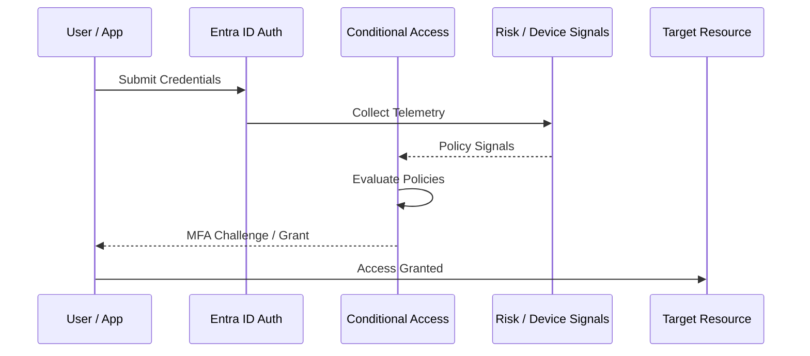

### 4. Policy Control Plane
The "Brain" of the framework managing global institutional standards and policy-as-code.

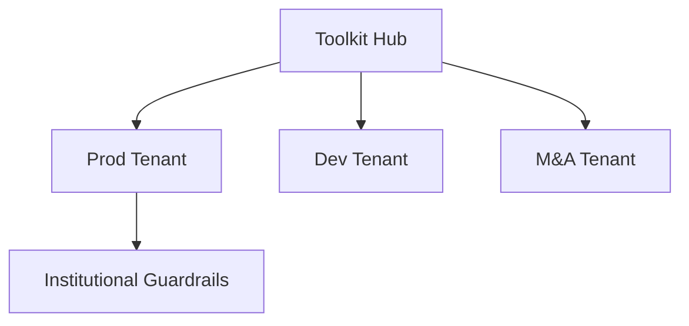

### 5. Multi-Tenant Topology
Synchronizing institutional identity standards across multiple Entra ID tenants.

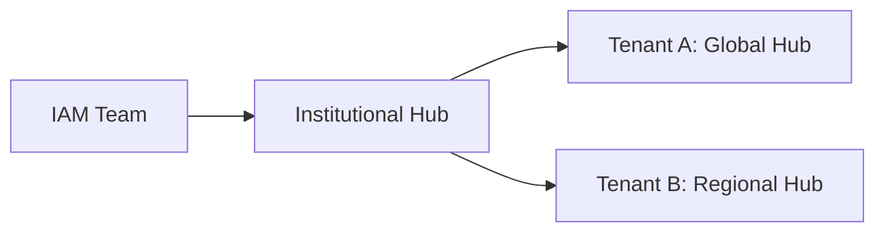

### 6. Regional Deployment Model
Hosting identity platform services close to the business users for low latency.

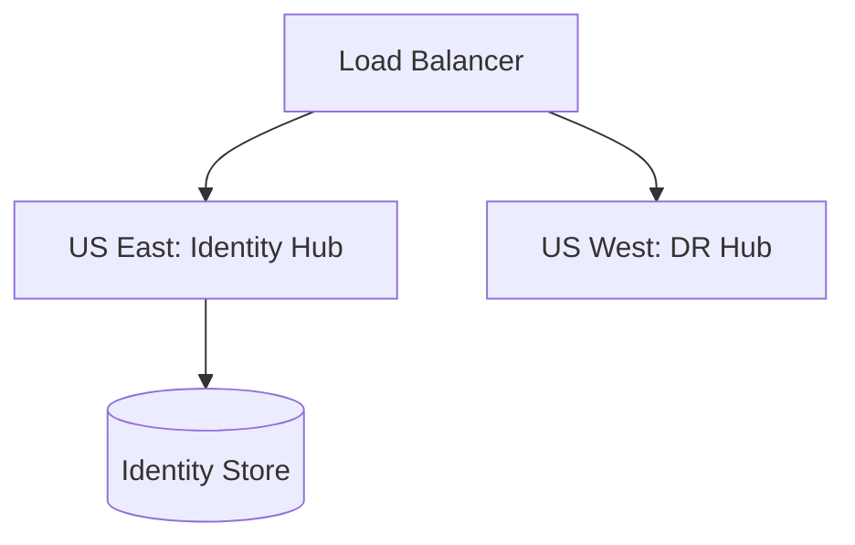

### 7. DR Failover Model
Ensuring platform continuity for critical identity services and shared infrastructure.

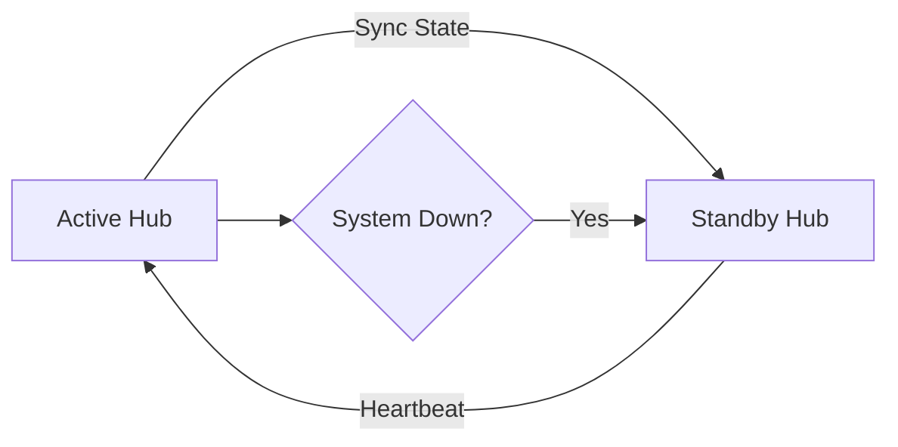

### 8. API Gateway Architecture
Securing and throttling the entry point for platform orchestration and metadata access.

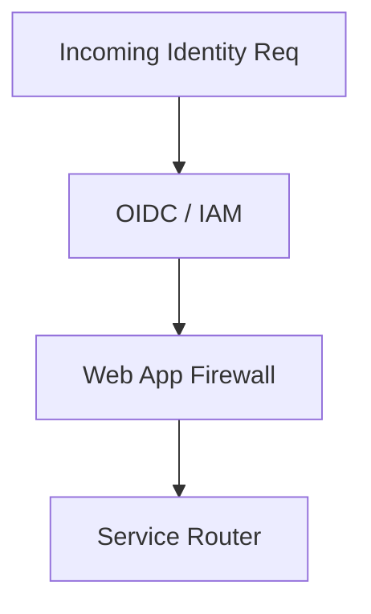

### 9. Queue Worker Architecture
Managing long-running policy deployment and massive risk synchronization tasks.

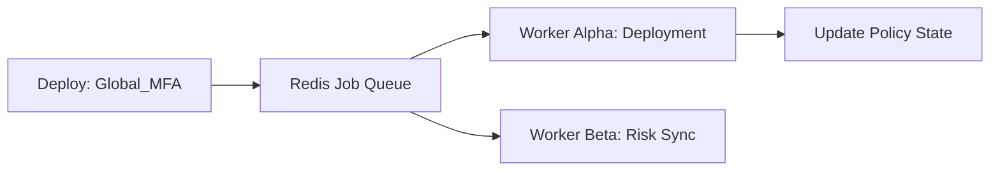

### 10. Dashboard Analytics Flow
How raw identity telemetry becomes executive institutional readiness scorecards.

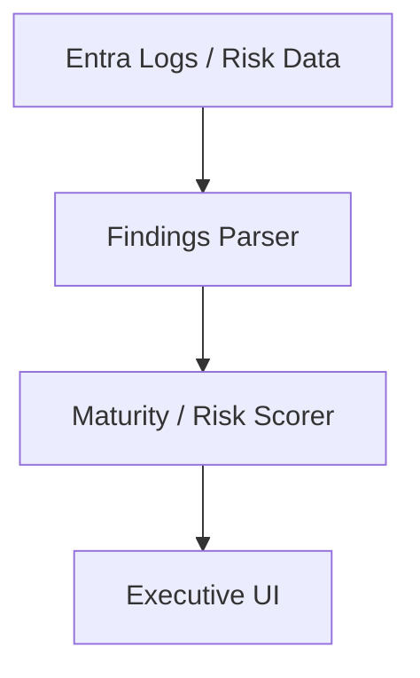

### 11. Policy Evaluation Workflow
The sequence of checks performed by Entra ID for every access request.

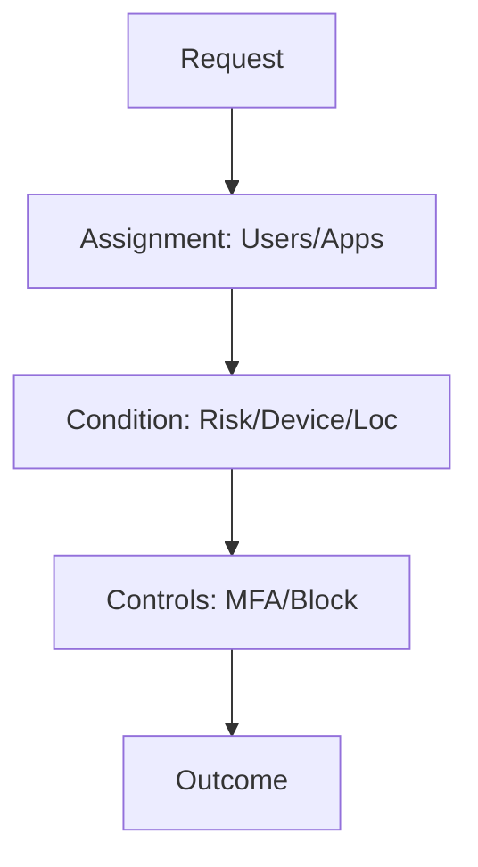

### 12. Grant Controls Decision Tree
Determining whether to grant access, require MFA, or enforce device compliance.

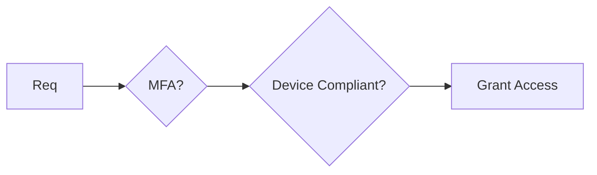

### 13. Session Controls Flow
Enforcing real-time session monitoring and limiting access for unmanaged devices.

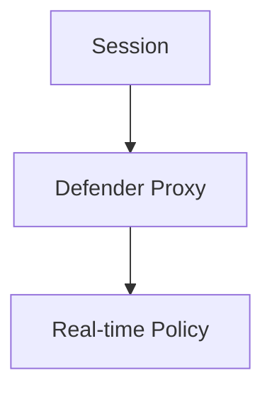

### 14. Report-Only Mode Lifecycle
Safe testing and validation of policies before institutional enforcement.

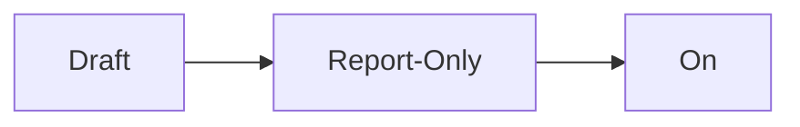

### 15. Progressive Rollout Model
Strategically deploying CA changes to groups of users to minimize disruption.

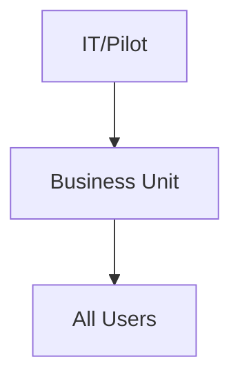

### 16. Policy Precedence Pattern
How Entra ID resolves conflicts when multiple policies apply to a single request.

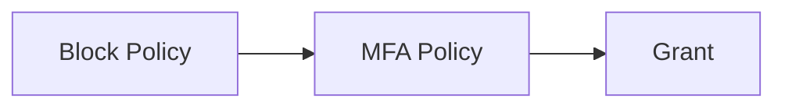

### 17. Named Locations Model
Whitelisting corporate networks and blocking high-risk geographic regions.

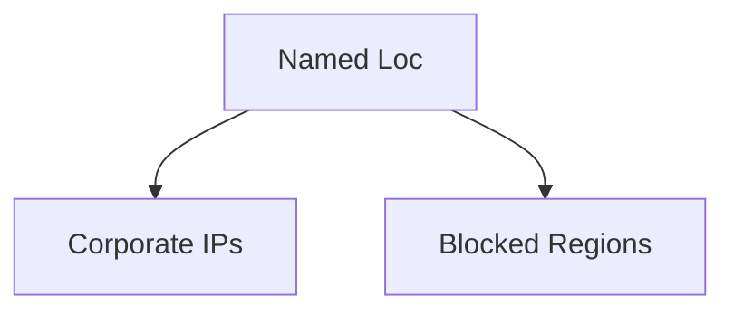

### 18. Device Filter Workflow
Targeting specific device types or attributes (e.g., "Exclude Surface Hubs") in policies.

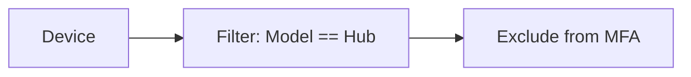

### 19. Authentication Strengths Flow
Requiring specific MFA methods (e.g., FIDO2) for high-privilege access.

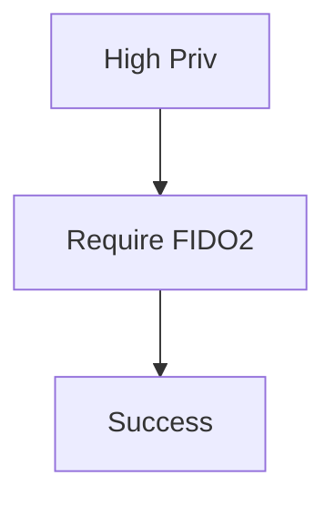

### 20. Legacy Auth Block Model
The critical security baseline for eliminating legacy protocol vulnerabilities.

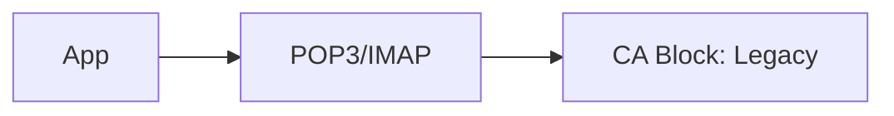

### 21. MFA Registration Campaign
Industrializing the rollout of MFA through automated nudges and deadlines.

```mermaid
graph TD
    Start[User v1] --> Nudge[Nudge: 14d] --> Enforce[Must Register]
```

### 22. Per-User to CA Migration Flow
Moving from legacy per-user MFA to modern, policy-based Conditional Access.

```mermaid
graph LR
    Old[Per-User MFA] --> Migrate[Migration Job] --> New[CA Policy]
```

### 23. Risk-Based MFA Challenge
Only triggering MFA when the sign-in signal shows medium or high risk.

```mermaid
graph TD
    Req[Sign-in] --> Risk{Medium Risk?} --> MFA[Trigger MFA]
```

### 24. User Risk Remediation Lifecycle
The automated path for resetting passwords when identity theft is suspected.

```mermaid
graph LR
    Detect[User Compromise] --> Action[Block & Reset] --> Clear[Remediated]
```

### 25. Sign-in Risk Workflow
Real-time protection against impossible travel and anonymous IP logins.

```mermaid
graph TD
    Sign[Sign-in] --> Detect[Anon IP] --> Challenge[MFA / Block]
```

### 26. Passwordless Adoption Model
Strategic journey toward FIDO2 and Microsoft Authenticator (Phone Sign-in).

```mermaid
graph LR
    PWD[Passwd] --> APP[Authenticator] --> FIDO[FIDO2]
```

### 27. FIDO2 Rollout Pattern
Deploying hardware security keys for admin and high-risk workforce.

```mermaid
graph TD
    Admin[Admin] --> Key[Hardware Key] --> Sec[Elite Access]
```

### 28. Temporary Access Pass Model
Providing secure, time-bound access for new hires or lost device recovery.

```mermaid
graph LR
    Req[Loss] --> TAP[Temp Pass: 1hr] --> Setup[New Method]
```

### 29. Self-Service Reset Journey
Empowering users to remediate their own account issues securely.

```mermaid
graph TD
    Issue[Forgot PWD] --> Reset[Self-Service] --> Back[Productive]
```

### 30. Credential Theft Defense Flow
Protecting against token theft and replay attacks through session frequency.

```mermaid
graph LR
    Theft[Token Replay] --> CA[Session Expired] --> MFA[Re-auth]
```

### 31. Intune Compliance Decision Flow
The criteria for marking a device as "Healthy" and "Access Ready."

```mermaid
graph TD
    Check[Compliance] --> OS[Update Check] --> AV[Anti-Virus]
```

### 32. Hybrid Join Trust Model
Verifying both Azure AD and local AD identity for managed Windows devices.

```mermaid
graph LR
    AD[Local AD] <-> Entra[Azure AD] <-> Dev[Trust]
```

### 33. Compliant Device Access Path
The fast-track for users on known, healthy, and encrypted endpoints.

```mermaid
graph LR
    User[Dev] --> Health[Intune: Pass] --> CA[Grant Access]
```

### 34. BYOD App Protection Model
Securing corporate data within mobile apps on unmanaged personal devices.

```mermaid
graph TD
    MAM[Intune MAM] --> Outlook[Outlook: Encrypted]
```

### 35. Managed Browser Session Flow
Requiring Microsoft Edge with specific security policies for SaaS access.

```mermaid
graph LR
    Sess[Browser] --> Edge[Edge Policy] --> App[Office 365]
```

### 36. Defender Risk Integration
Using endpoint risk scores to dynamically block access to corporate data.

```mermaid
graph TD
    Inf[Virus Detected] --> Risk[Risk: High] --> Block[CA: Deny]
```

### 37. Device Quarantine Lifecycle
Automating the isolation of infected or non-compliant devices.

```mermaid
graph LR
    Fail[Comp Fail] --> Isolation[Quarantine] --> Remed[Fix]
```

### 38. Certificate Trust Workflow
Enforcing access based on the presence of an institutional machine certificate.

```mermaid
graph TD
    Auth[Req] --> Cert[Cert Present?] --> Grant[Access]
```

### 39. Mac/Linux Compliance Model
Standardizing health checks for non-Windows platforms in the estate.

```mermaid
graph LR
    OS[macOS] --> Policy[FileVault On] --> Access[Grant]
```

### 40. Kiosk/Shared Device Model
Specialized policies for front-line workers and shared terminal environments.

```mermaid
graph TD
    Kiosk[Shared] --> AutoLog[Auto-Logout] --> Secure[Session Clear]
```

### 41. B2B Collaboration Model
Governing how external guests access institutional SharePoint and Teams.

```mermaid
graph LR
    Guest[External] --> B2B[B2B Policy] --> Teams[Collaboration]
```

### 42. Cross-Tenant Access Settings
Configuring trust relationships with partner Entra ID organizations.

```mermaid
graph TD
    OrgA[HQ] <-> Trust[Cross-Tenant Policy] <-> OrgB[Partner]
```

### 43. SaaS App Federation Workflow
Standardizing SSO and Conditional Access for Salesforce, Slack, and AWS.

```mermaid
graph LR
    App[SaaS] --> SAML[SAML/OIDC] --> Entra[Identity Hub]
```

### 44. Admin Portal Protection Model
Enforcing the highest security standards for Azure and Microsoft 365 portals.

```mermaid
graph TD
    Portal[Azure Portal] --> MFA[Require FIDO2] --> SAW[Sec Admin Workstation]
```

### 45. VPN Modern Auth Flow
Securing remote access through OIDC/SAML instead of legacy RADIUS.

```mermaid
graph LR
    VPN[VPN] --> OIDC[Entra Auth] --> Grant[Access]
```

### 46. Service Account Governance
Identifying and securing non-human identities used for automation.

```mermaid
graph TD
    SA[Service Acc] --> Policy[Fixed IP Only] --> App[Auth]
```

### 47. App Consent Governance Model
Preventing "Illicit Consent" attacks through admin-approved app registration.

```mermaid
graph LR
    App[New App] --> Review[Admin Review] --> Auth[Approve]
```

### 48. High Privilege Admin Isolation
Isolating Global Admins and Privileged roles from standard user productivity.

```mermaid
graph TD
    Role[Global Admin] --> NoMail[No Mail / No Web]
```

### 49. Contractor Access Lifecycle
Automating the onboarding and time-bound offboarding of external labor.

```mermaid
graph LR
    Join[Contract] --> Active[90 Days] --> Leave[Auto-Disable]
```

### 50. Merger Acquisition Tenant Onboarding
Rapidly securing and auditing acquired tenants during corporate integration.

```mermaid
graph TD
    Acq[Acquisition] --> Audit[Policy Scan] --> Merge[Align]
```

### 51. OIDC / SSO Auth Flow
The foundation of modern institutional single sign-on.

```mermaid
graph LR
    User[Dev] --> SSO[Entra Auth] --> Portal[App Hub]
```

### 52. RBAC Model
Defining granular roles for Security Admins and Identity Operators.

```mermaid
graph TD
    Role[Identity Admin] --> Perm[Manage Policies]
```

### 53. Privileged Identity Management flow
Providing "Just-in-Time" access for sensitive administrative tasks.

```mermaid
graph LR
    User[Admin] --> Request[Request Elevate] --> Approve[Approve]
```

### 54. Break-glass emergency access model
The critical "Last Resort" access path for platform disaster recovery.

```mermaid
graph TD
    DR[Disaster] --> Vault[Get Key] --> Login[Break-Glass Acc]
```

### 55. Audit Logging Architecture
The unified path for sign-in and audit logs to the institutional data lake.

```mermaid
graph LR
    Sign[Logs] --> EventHub[Streaming] --> Sentinel[SIEM]
```

### 56. Metrics Pipeline
Transforming identity telemetry into real-time health and risk metrics.

```mermaid
graph TD
    App[Auth] --> Prom[Prometheus] --> Graf[Grafana]
```

### 57. Logging Architecture
The multi-layered approach to capturing identity and security events.

```mermaid
graph LR
    Log[Log] --> Forwarder[Fluent] --> Hub[Loki/Monitor]
```

### 58. Tracing Model
Observing identity authentication chains across hybrid and multi-cloud.

```mermaid
graph TD
    User[User] --> AD[Local AD] --> Entra[Cloud Auth]
```

### 59. Incident Response Workflow
The automated playbook for responding to identity-based threats.

```mermaid
graph TD
    Alarm[Alert] --> Playbook[Disable Acc] --> Invest[Investigate]
```

### 60. Identity Attack Kill Chain Disruption
Where Conditional Access breaks the attacker's path to data exfiltration.

```mermaid
graph LR
    Phish[Phish] --> MFA[Block: MFA Req]
```

### 61. Executive KPI Review Cycle
Reporting identity security progress to the Board and C-suite.

```mermaid
graph TD
    Stats[Stats] --> Deck[Executive Summary]
```

### 62. MFA Coverage Scorecard
Measuring the percentage of users and apps protected by MFA.

```mermaid
graph LR
    Users[99% MFA] --- Apps[85% MFA]
```

### 63. Risk Reduction Heatmap
Visualizing the decline in identity-based incidents over time.

```mermaid
graph TD
    Jan[High Risk] --> Dec[Low Risk]
```

### 64. Compliance Evidence Workflow
Generating automated reports for identity-related audit requirements.

```mermaid
graph LR
    Scan[Scan] --> Report[PDF Evidence] --> Audit[Success]
```

### 65. Audit Readiness Model
Continuously validating the identity posture against institutional policies.

```mermaid
graph TD
    Baseline[Goal] <-> Actual[Status: 98%]
```

### 66. Helpdesk Ticket Reduction model
Measuring the ROI of self-service password reset and MFA registration.

```mermaid
graph TD
    Self[Self-Service] --> Savings[$$ Saved]
```

### 67. Quarterly Governance Cadence
Reviewing policy exceptions and privileged access on a set schedule.

```mermaid
graph TD
    Q1[Review] --> Q2[Recertify]
```

### 68. Board Reporting Model
Communicating Zero Trust maturity and risk posture to non-technical leaders.

```mermaid
graph LR
    Risk[Risk] --> Maturity[Maturity Index]
```

### 69. Identity Maturity Roadmap
The journey from "Legacy Perimeter" to "Industrialized Zero Trust."

```mermaid
graph LR
    S1[Legacy] --> S4[Elite ZT]
```

### 70. Continuous Improvement Loop
The engine for evolving identity security based on real-world threat Intel.

```mermaid
graph LR
    Watch[Monitor] --> Adapt[Policy Change]
```

### 71. Zero Trust Maturity Model
Mapping the identity pillars to the CISA Zero Trust framework.

```mermaid
graph TD
    ZT[Zero Trust] --> Ident[Identity]
```

### 72. AI Anomaly Detection Flow
Using machine learning to identify suspicious identity patterns.

```mermaid
graph LR
    Log[Log] --> ML[Model] --> Alert[Anomaly]
```

### 73. Adaptive Access Engine
Dynamically adjusting access controls based on continuous signal evaluation.

```mermaid
graph TD
    Sess[Active] --> RiskChange[Risk Up] --> ReAuth[Trigger MFA]
```

### 74. Insider Risk Correlation Model
Linking identity behavior with data access to detect malicious insiders.

```mermaid
graph LR
    Auth[Sign-in] <-> File[Large Download]
```

### 75. Multi-country Identity Governance
Managing local regulatory requirements (GDPR, etc.) within a global tenant.

```mermaid
graph TD
    Global[Tenant] --> EU[Local Policy] --> APAC[Local Policy]
```

### 76. Sovereign Cloud Identity Pattern
Architecture for highly regulated or government-isolated environments.

```mermaid
graph LR
    Gov[Gov Cloud] <-> Com[Commercial Hub]
```

### 77. Passwordless Future State
The vision for a credential-free institutional workforce.

```mermaid
graph TD
    Passwd[Retired] --> FIDO[FIDO2 Everywhere]
```

### 78. Secure Developer Access Model
Protecting GitHub, Azure DevOps, and cloud consoles for the engineering team.

```mermaid
graph LR
    Dev[Dev] --> PIM[Elevate] --> Cloud[Access]
```

### 79. External Identities Roadmap
The evolution of guest and partner access governance.

```mermaid
graph LR
    B2B[Guest] --> CIAM[Customer IAM]
```

### 80. Innovation Portfolio Roadmap
Planning the next 36 months of identity security evolution.

```mermaid
graph TD
    Now[Now] --> Year3[AI-Native IAM]
```

### 81. Graph API Sync Workflow
Reliably synchronizing institutional policies via the Microsoft Graph.

```mermaid
graph LR
    Hub[CAT Hub] --> Sync[Graph API] --> Entra[Tenant]
```

### 82. Policy Backup/Restore Lifecycle
Protecting the source of truth for identity policies across clouds.

```mermaid
graph TD
    Active[Live] --> Backup[Git Store]
```

### 83. Change Management Workflow
Standardizing changes to critical identity and security configurations.

```mermaid
graph TD
    Req[Req] --> Review[Review] --> Approve[Deploy]
```

### 84. Policy Exception Approval process
Governing and auditing the rare cases where users bypass security controls.

```mermaid
graph LR
    Req[Exception] --> Risk[Risk Assess] --> Auth[Approve]
```

### 85. Tenant Baseline Comparison
Comparing the security posture of multiple tenants against a gold standard.

```mermaid
graph TD
    Baseline[Gold] <-> T1[Tenant A] <-> T2[Tenant B]
```

---

## 🔬 Identity Security Methodology

### 1. Zero Trust Pillars
Our platform is built on the core Zero Trust pillars:
- **Verify Explicitly**: Always authenticate and authorize based on all available data points.
- **Use Least Privileged Access**: Limit user access with Just-In-Time and Just-Enough-Access (JIT/JEA).
- **Assume Breach**: Minimize the blast radius and segment access.

### 2. The Identity Perimeter
We provide an "Identity Hub" model that ensures every authentication is monitored, every risk is remediated, and every device is verified before granting access to the institutional estate.

---

## 🚦 Getting Started

### 1. Prerequisites
- **Microsoft Entra ID** (Azure AD) P1 or P2 license.
- **Global Administrator** or **Conditional Access Administrator** role.
- **Terraform** & **PowerShell** (7.x+).

### 2. Local Setup
```bash
# Clone the repository
git clone https://github.com/Devopstrio/entra-id-conditional-access-toolkit.git
cd entra-id-conditional-access-toolkit

# Start the Toolkit Control Plane
docker-compose up --build
```
Access the Portal at `http://localhost:3000`.

---

## 🛡️ Governance & Security
- **Identity First**: Deep integration with Entra ID and OIDC for unified platform access.
- **Break-Glass Ready**: Pre-configured emergency access accounts and monitoring.
- **Audit Ready**: Built-in evidence generation for identity compliance audits.

---
<sub>&copy; 2026 Devopstrio &mdash; Engineering the Future of Industrialized Identity Security.</sub>
