<div align="center">


<h1>Entra ID Conditional Access Toolkit</h1>

<p><strong>The Institutional-Grade Platform for Microsoft Entra ID Conditional Access, Zero Trust Policy Governance, and Multi-Tenant Security Orchestration.</strong></p>

[]()
[]()
[]()

<br/>

> **"Industrializing identity security to automate Zero Trust access boundaries."** 
> **Entra ID Conditional Access Toolkit (EI-CAT)** is an enterprise-grade platform designed to provide a secure, measurable, and highly automated foundation for global identity operations. It orchestrates the complex lifecycle of access—from policy authoring and simulation to signal-driven enforcement and unified access auditing.

</div>

---

## 🏛️ Executive Summary

Fragmented access policies and manual security review workflows are strategic operational liabilities; lack of centralized access orchestration is a primary barrier to organizational cloud maturity. Organizations fail to maintain a secure identity foundation not because of a lack of policies, but because of fragmented security standards, lack of automated signal validation, and an inability to orchestrate access planes with operational precision.

This platform provides the **Conditional Access Intelligence Plane**. It implements a complete **Enterprise CA-Toolkit-as-Code Framework**, enabling Security and Identity teams to manage global access foundations as first-class citizens. By automating the identification of policy bypasses through real-time telemetry analysis and orchestrating the deployment of secure performance-driven access policies, we ensure that every organizational service—from core corporate users to distributed guest tenants—is governed by default, audited for history, and strictly aligned with institutional identity frameworks.

---

## 📐 Architecture Storytelling: Principal Reference Models

### 1. Principal Architecture: Global Entra ID Conditional Access & Policy Intelligence Plane
This diagram illustrates the end-to-end flow from policy ingestion and multi-tenant orchestration to signal enforcement, performance validation, and institutional access auditing.

```mermaid
graph LR
    %% Subgraph Definitions
    subgraph SignalIngress["User & Device Signal Ingress"]
        direction TB
        Identity_Signals["Sign-in / User / Risk / IP Signals"]
        Device_Signals["Compliance / Managed / Health Signals"]
        App_Signals["Protocol / SaaS / Client App Signals"]
    end

    subgraph IntelligenceEngine["CA Intelligence Hub"]
        direction TB
        API["FastAPI CA Gateway"]
        PolicyOrchestrator["Global Policy & Assignment Hub"]
        SignalGuard_Hub["Telemetry & Decision Hub"]
        AIOps_Validator["Bypass & Drift Analysis Hub"]
    end

    subgraph OperationsPlane["Distributed Zero-Trust Fleet"]
        direction TB
        ActivePolicies["Managed Active CA Policies"]
        PilotPolicies["Managed Report-Only / Test Policies"]
        ResourceGuards["Managed App & VNET Access Guards"]
    end

    subgraph OperationsHub["Institutional Access Hub"]
        direction TB
        Scorecard["CA Maturity Scorecard"]
        Analytics["Decision Flow & MFA Velocity Stats"]
        Audit["Forensic Access Metadata Lake"]
    end

    subgraph DevOps["CA-Toolkit-as-Code Framework"]
        direction TB
        TF["Terraform Policy Modules"]
        DriftBot["Access & Config Drift Validator"]
        ChatOps["Access Operations Hub"]
    end

    %% Flow Arrows
    SignalIngress -->|1. Submit Signal| API
    API -->|2. Orchestrate Decision| PolicyOrchestrator
    PolicyOrchestrator -->|3. Apply Enforcement| SignalGuard_Hub
    SignalGuard_Hub -->|4. Assess Drift| AIOps_Validator
    
    AIOps_Validator -->|5. Execute Provision| OperationsPlane
    OperationsPlane -->|6. Notify Status| ChatOps
    API -->|7. Visualize Health| Scorecard
    
    Scorecard -->|8. Track Maturity| Analytics
    Scorecard -->|9. Record Provision| Audit
    
    TF -->|10. Provision Backbone| IntelligenceEngine
    DriftBot -->|11. Inject Access Risk| PolicyOrchestrator
    Audit -->|12. Improve Operations| ActivePolicies

    %% Styling
    classDef ingress fill:#f5f5f5,stroke:#616161,stroke-width:2px;
    classDef intel fill:#e8eaf6,stroke:#1a237e,stroke-width:2px;
    classDef operations fill:#e1f5fe,stroke:#01579b,stroke-width:2px;
    classDef ops fill:#ede7f6,stroke:#311b92,stroke-width:2px;
    classDef devops fill:#e8f5e9,stroke:#1b5e20,stroke-width:2px;

    class SignalIngress ingress;
    class IntelligenceEngine intel;
    class OperationsPlane operations;
    class OperationsHub ops;
    class DevOps devops;
```

### 2. The CA Policy Lifecycle Flow
The continuous path of an access policy from initial author (policy) and test (what-if) to active deploy (pilot), enforce (global), and institutional forensic auditing.

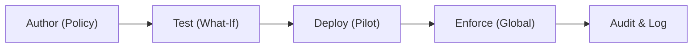

### 3. Distributed Zero-Trust Topology
Strategically orchestrating conditional access across global cloud regions, diverse user groups, and multi-tenant environments, providing a unified institutional view of global access health and identity readiness.

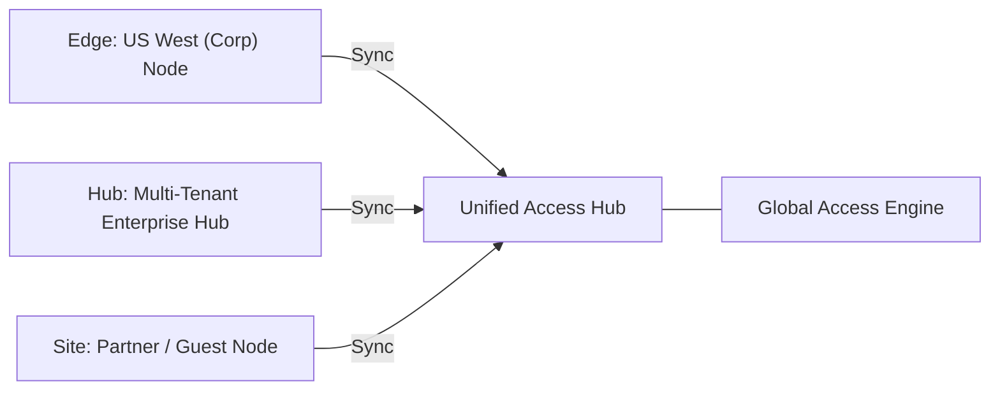

### 4. Signal-to-Decision & High-Trust Data Plane Protection Flow
Executing complex logic for securing the bridge between user/device signals and policy evaluation, ensuring every organizational identity is verified and every access access is according to institutional standards.

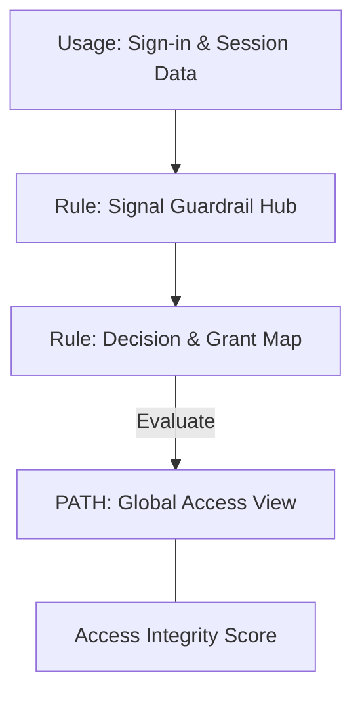

### 5. Multi-Tenant CA Federation & Governance Flow
Automatically managing unified conditional access standards across global regions and diverse Entra ID tenants, ensuring institutional data residency and security boundaries by default.

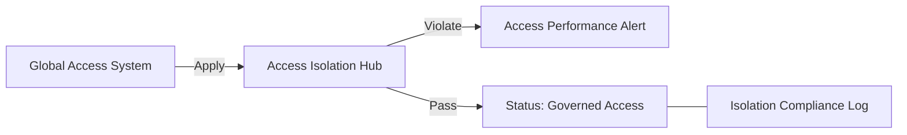

### 6. Encryption & Perimeter Protection Flow (CA Standard)
Managing the lifecycle of an access request, automatically enforcing institutional MFA and session control standards as required by security policy, ensuring zero-latency security confidence.

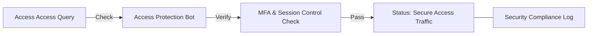

### 7. Institutional CA Maturity Scorecard
Grading organizational performance based on key indicators: Security Coverage Grade, MFA Enforcement Index, and Legacy Auth Blocking Index.

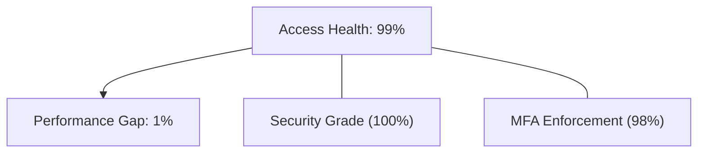

### 8. Identity & RBAC for CA Governance
Managing fine-grained access to access hubs, provisioning workers, and audit logs between CA Architects, Security Operations, and Compliance Auditors.

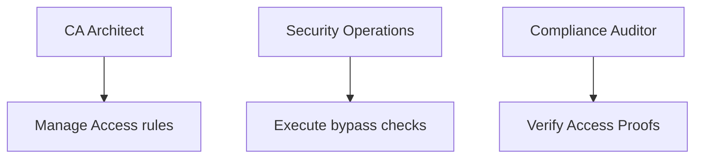

### 9. IaC Deployment: CA-Toolkit-as-Code Framework
Using modular Terraform to deploy and manage the versioned distribution of the access tracking hubs, signal protection workers, and forensic metadata lakes.

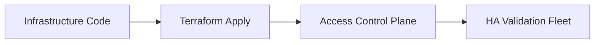

### 10. AIOps CA Drift & Bypass Validation Flow
Using advanced analytics to identify sudden surges in policy bypasses, unauthorized policy changes, suspicious configuration drifts, or unusual access pattern changes that could result in institutional risk.

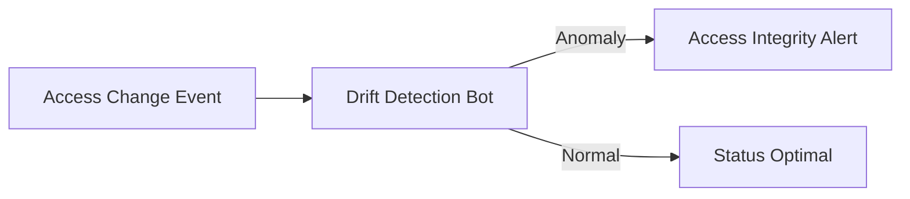

### 11. Metadata Lake for Forensic CA Audit
Storing long-term records of every policy change (metadata), every security event recorded, and every access decision log for institutional record-keeping, compliance auditing, and post-provisioning forensics.

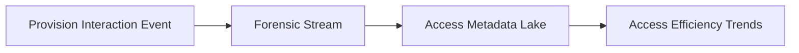

---

## 🏛️ Core Governance Pillars

1.  **Unified Foundation Coordination**: Maximizing resilience by centralizing all access measurement through a single institutional plane.
2.  **Automated Policy Provisioning**: Eliminating "manual security" scenarios through proactive orchestration and pattern verification.
3.  **Sequential Signal Intelligence**: Ensuring zero-interruption operations through dependency-aware signal-driven access engineering.
4.  **Zero-Trust Access Protection**: Automatically enforcing identity-based access and rule evaluation across all access tiers.
5.  **Autonomous Operations Logic**: Guaranteeing reliability through automated industry-specific access monitoring runbooks.
6.  **Full Access Auditability**: Immutable recording of every policy change and signal provision for institutional forensics.

---

## 🛠️ Technical Stack & Implementation

### Access Engine & APIs
*   **Framework**: Python 3.11+ / FastAPI.
*   **Performance Engine**: Custom Python-based logic for multi-tenant access provisioning and DORA-style risk metrics.
*   **Integrations**: Native connectors for Microsoft Entra ID (Graph API), Intune, and Defender.
*   **Persistence**: PostgreSQL (Access Ledger) and Redis (Live Decision State).
*   **Auth Orchestrator**: Federated OIDC/SAML for least-privilege access management access.

### Governance Dashboard (UI)
*   **Framework**: React 18 / Vite.
*   **Theme**: Dark, Slate, Indigo (Modern high-fidelity access aesthetic).
*   **Visualization**: D3.js for access topologies and Recharts for MFA velocity analytics.

### Infrastructure & DevOps
*   **Runtime**: AWS EKS or Azure Kubernetes Service (AKS) for management plane.
*   **Access Hub**: Managed event sourcing for immutable access security timeline reconstruction.
*   **IaC**: Modular Terraform for deploying the access landing zone and validation fleet.

---

## 🏗️ IaC Mapping (Module Structure)

| Module | Purpose | Real Services |
| :--- | :--- | :--- |
| **`infrastructure/access_hub`** | Central management plane | EKS, PostgreSQL, Redis |
| **`infrastructure/enforcers`** | Distributed access provisioners | Entra ID, Intune, Defender APIs |
| **`infrastructure/signal_pipes`** | Access Ingestion Hubs | Webhooks, Lambda |
| **`infrastructure/auditing`** | Forensic access sinks | S3, Athena, Quicksight |

---

## 🚀 Deployment Guide

### Local Principal Environment
```bash
# Clone the landing zone platform
git clone https://github.com/devopstrio/entra-id-conditional-access-toolkit.git
cd entra-id-conditional-access-toolkit

# Configure environment
cp .env.example .env

# Launch the EI-CAT stack
make init

# Trigger a mock policy update and automated signal validation simulation
make simulate-eicat
```

Access the Management Portal at `http://localhost:3000`.

---

## 📜 License
Distributed under the MIT License. See `LICENSE` for more information.

---
<div align="center">
  <p>© 2026 Devopstrio. All rights reserved.</p>
</div>
